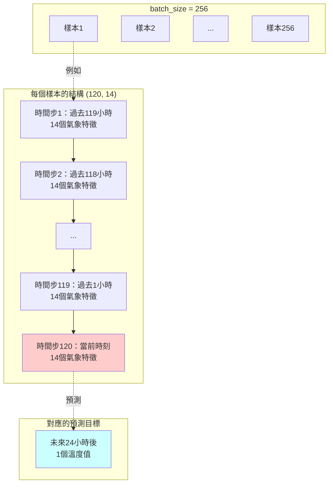
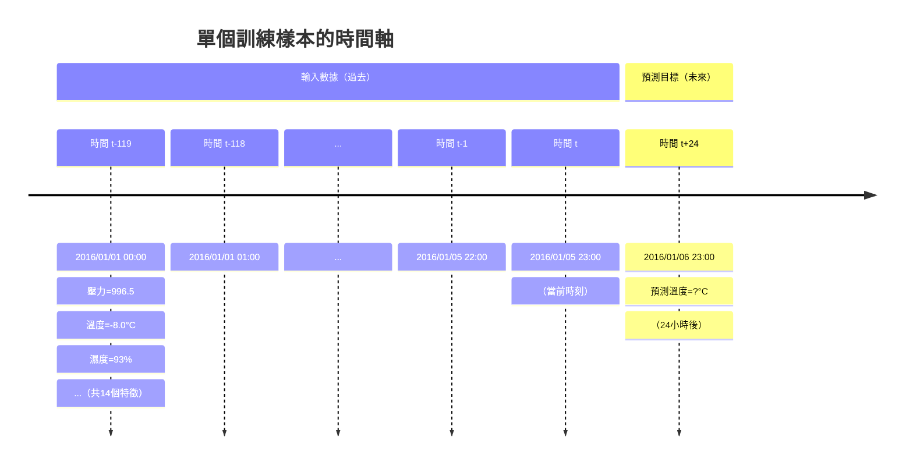
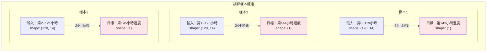
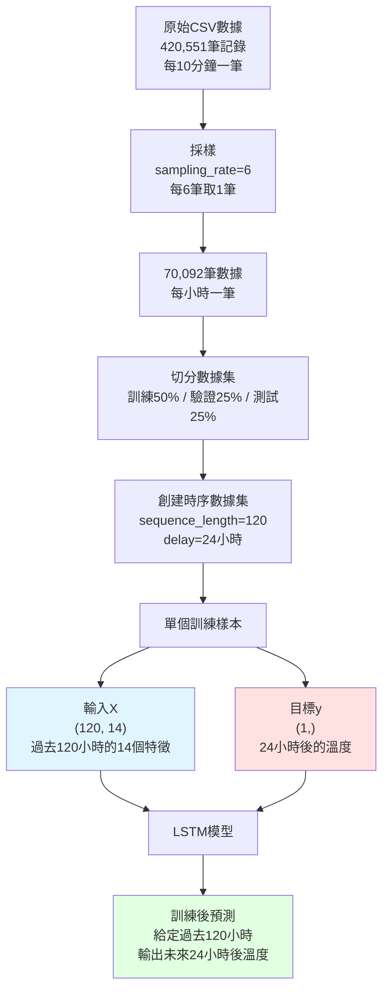
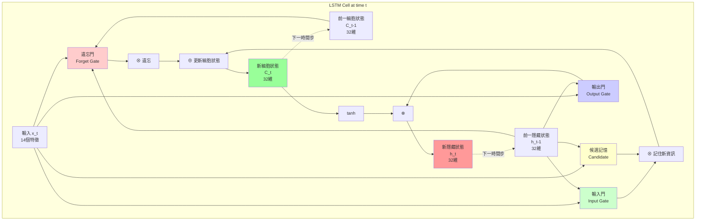
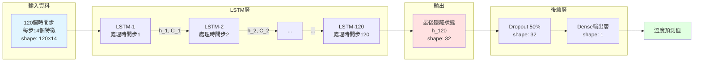
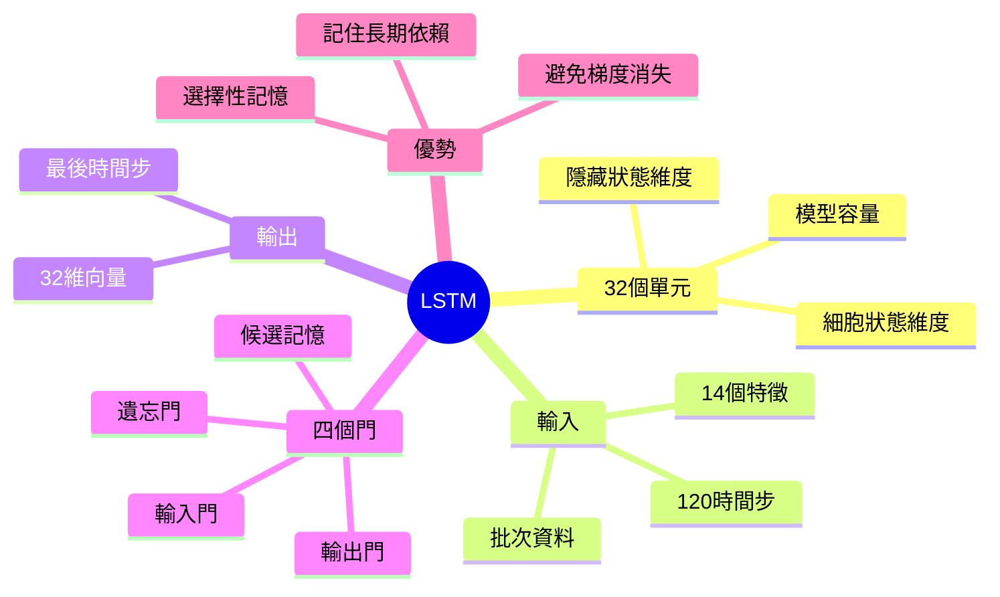

# LSTM 架構詳解

## `layers.LSTM(32, recurrent_dropout=0.25)(input)` 中的 32 是什麼？

**32 是 LSTM 單元的數量（units）**，也就是隱藏狀態（hidden state）的維度。

- 輸入：shape = `(batch_size, 120, 14)` - 120個時間步，每步14個特徵
- LSTM處理後輸出：shape = `(batch_size, 32)` - 32維的特徵向量
- `recurrent_dropout=0.25`：在循環連接上應用25%的dropout防止過擬合

---

## 重要概念：輸入數據的時間區間與預測目標

### `(batch_size, 120, 14)` 的詳細解釋



### 時間步（Timestep）的定義

**時間步（Timestep）** 是時間序列中的基本時間單位。在這個項目中：

```python
# 原始數據：每10分鐘記錄一次
CSV記錄頻率 = 10分鐘/筆

# 代碼第34行
sampling_rate = 6  # 每6筆原始數據取1筆

# 計算一個時間步的實際時間
1 timestep = 6 × 10分鐘 = 60分鐘 = 1小時
```

**✅ 所以在這個項目中，1個時間步 = 1小時**

但要注意：時間步的長度取決於 `sampling_rate`，不是固定的！

| sampling_rate | 1個時間步的實際時間 |
|---------------|-------------------|
| 1 | 10分鐘 |
| 6 | 1小時（你的代碼） |
| 12 | 2小時 |
| 144 | 24小時（1天） |

### 維度詳解

| 維度 | 數值 | 意義 | 如何得到 |
|------|------|------|----------|
| **batch_size** | 256 | 一次訓練的樣本數量 | 代碼第37行：`batch_size = 256` |
| **120** | **時間步數（Timesteps）** | **過去120個時間步的歷史數據**<br/>= 過去120小時 | 代碼第35行：`sequence_length = 120` |
| **14** | **特徵數（Features）** | 每個時間點的氣象特徵 | 代碼第97行：`raw_data.shape[-1]`<br/>= CSV總列數15 - 時間列1 = 14 |

**14個特徵詳細列表**（從CSV的第2~15列）：
1. p (mbar) - 氣壓
2. T (degC) - 溫度
3. Tpot (K) - 位溫
4. Tdew (degC) - 露點溫度
5. rh (%) - 相對濕度
6. VPmax (mbar) - 飽和水汽壓
7. VPact (mbar) - 實際水汽壓
8. VPdef (mbar) - 水汽壓差
9. sh (g/kg) - 比濕
10. H2OC (mmol/mol) - 水汽濃度
11. rho (g/m³) - 空氣密度
12. wv (m/s) - 風速
13. max. wv (m/s) - 最大風速
14. wd (deg) - 風向

### ⚠️ 常見誤解

❌ **錯誤**：120 代表預測未來120個時間點
✅ **正確**：120 代表輸入**過去**120個時間點的歷史數據

❌ **錯誤**：輸出是未來120小時的溫度序列
✅ **正確**：輸出是**未來24小時後**的**單一溫度值**

### 具體數據示例

假設原始數據每10分鐘記錄一次，`sampling_rate=6` 表示每小時取一個樣本：

```
原始數據採樣頻率：10分鐘/次
sampling_rate = 6  →  每6筆取1筆  →  1小時/次
sequence_length = 120  →  120小時的歷史
```

#### 訓練樣本示例



### 代碼中的關鍵參數

```python
# Untitled-1.py 第16行
raw_data = np.zeros((len(lines), len(header) - 1))
#                                 ^^^^^^^^^^^^^^
#                                 CSV有15列，減去第1列（時間）= 14個特徵

# Untitled-1.py 第34-37行
sampling_rate = 6              # 每6筆原始數據取1筆 = 1小時
sequence_length = 120          # 輸入120個時間步 = 過去120小時
delay = sampling_rate * (sequence_length + 24 - 1)
#       = 6 × (120 + 24 - 1)
#       = 6 × 143 = 858
# 意義：目標值是輸入序列最後一個時間點之後的24小時
batch_size = 256               # 一批訓練256個樣本

# Untitled-1.py 第97行
input = keras.Input(shape=(sequence_length, raw_data.shape[-1]))
#                          ^^^^^^^^^^^^^^^  ^^^^^^^^^^^^^^^^^^
#                          120個時間步       14個特徵
#                          shape = (120, 14)
```

### 數據配對關係



### 預測結果詳解

**問：預測結果是一個時間點的資料嗎？**

**答：是的！** 預測結果是**單一時間點的單一數值**：

```python
# 模型輸出
output = layers.Dense(1)(x)  # 輸出層只有1個神經元

# 輸出shape
(batch_size, 1)  # 每個樣本預測1個溫度值

# 具體例子
樣本1：輸入過去120小時 → 預測 5.2°C（24小時後）
樣本2：輸入過去120小時 → 預測 5.5°C（24小時後）
...
樣本256：輸入過去120小時 → 預測 4.8°C（24小時後）
```

### 為什麼是24小時後？

```python
# Untitled-1.py 第36行
delay = sampling_rate * (sequence_length + 24 - 1)
#                                          ^^^
#                                   這個 24 決定預測多遠的未來

# 如果改成：
delay = sampling_rate * (sequence_length + 48 - 1)  # 預測48小時後
delay = sampling_rate * (sequence_length + 12 - 1)  # 預測12小時後
```

### 完整的輸入輸出流程



### 總結：時間區間完整說明

| 概念 | 數值 | 實際意義 |
|------|------|----------|
| **輸入時間跨度** | 120小時 | 過去5天的歷史數據 |
| **輸入時間點** | t-119 到 t | 從119小時前到當前時刻 |
| **預測時間點** | t+24 | 當前時刻的24小時後 |
| **預測數量** | 1個數值 | 只預測1個溫度值 |
| **預測類型** | 點預測 | 不是序列預測 |

**關鍵理解**：
- 模型看的是**過去** → 120個時間步
- 模型預測的是**未來** → 1個時間點
- 時間間隔 → 24小時

如果要預測未來多個時間點（如未來24小時的逐時溫度），需要改用**序列到序列（Seq2Seq）架構**，輸出層改為 `return_sequences=True` 的LSTM或其他架構。

## LSTM 內部結構

LSTM（Long Short-Term Memory）有4個主要門控機制：



## LSTM 四個門的功能

### 1. 遺忘門（Forget Gate）
```
f_t = σ(W_f · [h_t-1, x_t] + b_f)
```
- 決定從細胞狀態中丨棄多少舊資訊
- 輸出 0~1 之間的值（0=完全遺忘，1=完全保留）

### 2. 輸入門（Input Gate）
```
i_t = σ(W_i · [h_t-1, x_t] + b_i)
C̃_t = tanh(W_C · [h_t-1, x_t] + b_C)
```
- 決定要將多少新資訊存入細胞狀態
- `i_t`：控制門（0~1）
- `C̃_t`：候選值（-1~1）

### 3. 細胞狀態更新
```
C_t = f_t ⊗ C_t-1 + i_t ⊗ C̃_t
```
- 遺忘舊資訊 + 加入新資訊

### 4. 輸出門（Output Gate）
```
o_t = σ(W_o · [h_t-1, x_t] + b_o)
h_t = o_t ⊗ tanh(C_t)
```
- 決定輸出什麼資訊
- `h_t` 就是 LSTM 的輸出（32維）

## 完整模型資料流程



## 為什麼選擇 32 個單元？

這是一個**超參數**，需要根據任務調整：

- **太小**（如8）：模型容量不足，無法捕捉複雜的時間模式
- **太大**（如256）：容易過擬合，訓練慢，需要更多數據
- **32**：對於這個氣候預測任務是一個合理的平衡點

## 參數數量計算

LSTM 的參數數量公式：
```
參數總數 = 4 × (units × (units + input_dim + 1))
         = 4 × (32 × (32 + 14 + 1))
         = 4 × (32 × 47)
         = 6,016 個參數
```

其中 4 代表四個門（遺忘、輸入、輸出、候選）

## 關鍵概念總結



## 與普通RNN的區別

| 特性 | RNN | LSTM |
|------|-----|------|
| 記憶機制 | 只有隱藏狀態 h_t | 細胞狀態 C_t + 隱藏狀態 h_t |
| 長期依賴 | 容易遺忘（梯度消失） | 可以記住長期資訊 |
| 門控機制 | 無 | 3個門控制資訊流動 |
| 參數量 | 少 | 多（4倍） |

LSTM 通過細胞狀態這條"高速公路"，讓資訊可以在很長的時間序列中傳遞而不衰減！
