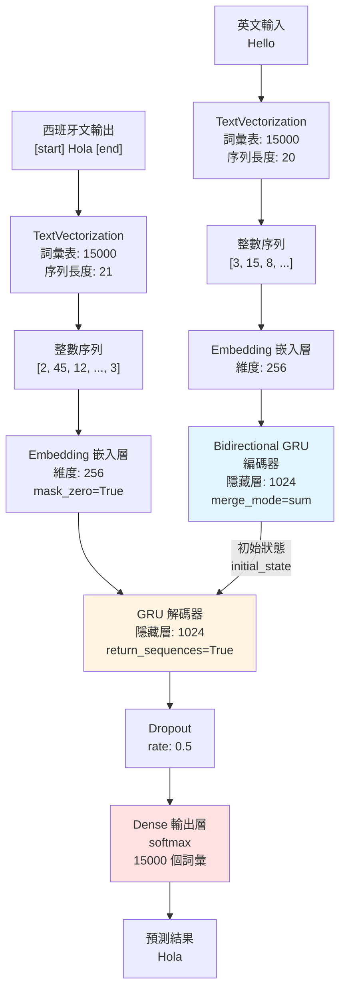
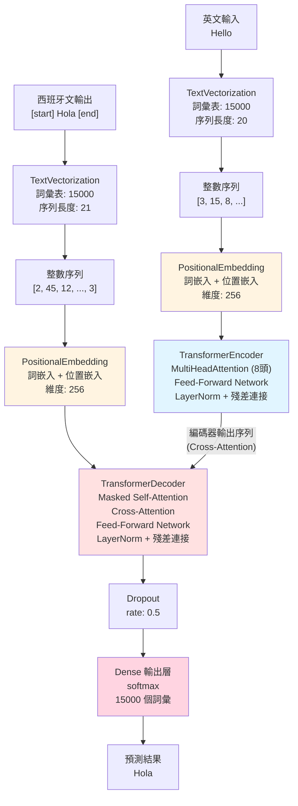
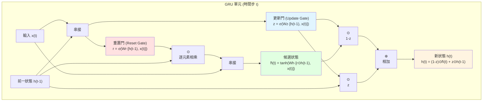

# Seq2seq 機器翻譯專案 (英文轉西班牙文)

本專案實現了兩種序列到序列 (sequence-to-sequence) 翻譯模型：
- **GRU 模型**: 使用門控循環單元 (Gated Recurrent Unit)
- **Transformer 模型**: 使用注意力機制 (Attention Mechanism)

## 專案架構圖

### GRU 模型架構



### Transformer 模型架構



**關鍵差異：**
- 🔵 **GRU**: 使用 Embedding（只有詞嵌入）
- 🟡 **Transformer**: 使用 PositionalEmbedding（詞嵌入 + 位置嵌入）
- 🔵 **GRU 編碼器**: 輸出單一上下文向量，通過 initial_state 傳遞
- 🔵 **Transformer 編碼器**: 輸出整個序列，通過 Cross-Attention 連接
- 🔴 **GRU 解碼器**: 單一 GRU 層
- 🔴 **Transformer 解碼器**: 兩層注意力（Masked Self-Attention + Cross-Attention）+ FFN
```

## 模型組件說明

### Embedding 層 (詞嵌入層)

**作用**: 將整數索引轉換為密集的向量表示

```python
# 編碼器的嵌入層
Embedding(vocab_size, embed_dim)  # (15000, 256)

# 解碼器的嵌入層
Embedding(vocab_size, embed_dim, mask_zero=True)  # (15000, 256)
```

**為什麼需要 Embedding？**
- 神經網絡無法直接處理離散的整數索引
- 將稀疏的 one-hot 編碼轉換為密集向量
- 在訓練中學習詞彙之間的語義關係
- 相似的詞會有相似的向量表示

**輸入輸出轉換：**
```
輸入：整數序列 [3, 15, 8, 42]
     shape: (batch_size, sequence_length)

                    ↓  Embedding 層

輸出：嵌入向量
     shape: (batch_size, sequence_length, 256)
     每個整數變成 256 維的浮點數向量
```

**mask_zero=True 的作用：**
- 將索引 `0` 視為填充符號 (padding)
- 在計算時自動忽略這些位置
- 用於處理不同長度的序列

**範例：**
```python
# 詞彙表: {"hello": 3, "world": 15, "good": 8, ...}
輸入 ID:  [3,    15,    8,    42   ]
         ↓     ↓      ↓     ↓
嵌入向量: [0.2,  [-0.1, [0.5,  [0.3,
          0.5,   0.3,   0.1,  -0.2,
          -0.1,  0.7,   0.4,   0.6,
          ...]   ...]   ...]   ...]
         256維  256維  256維  256維
```

---

### Bidirectional 層 (雙向包裝層)

**作用**: 讓 RNN 同時從兩個方向處理序列

```python
# 編碼器使用雙向 GRU
encoded_source = Bidirectional(
    GRU(latent_dim),  # 1024 維
    merge_mode="sum"
)(x)
```

**為什麼需要 Bidirectional？**
- 單向 RNN 只能看到"過去"的信息
- 雙向可以同時看到前後文，獲得更完整的理解
- 特別適合需要理解整個句子含義的任務（如翻譯編碼器）

**運作方式：**
```
輸入序列: ["I", "love", "you"]

前向 GRU (→):  I  →  love  →  you    (從左到右)
                                ↓
                            h_forward

後向 GRU (←):  I  ←  love  ←  you    (從右到左)
                                ↓
                            h_backward

merge_mode="sum": h_final = h_forward + h_backward
```

**merge_mode 參數比較：**

| merge_mode | 說明 | 輸出維度 | 特點 |
|------------|------|----------|------|
| `"sum"` | 相加 | 1024 | 節省參數，結合兩方向 |
| `"concat"` | 串接 | 2048 | 保留完整信息 |
| `"mul"` | 相乘 | 1024 | 強調共同特徵 |
| `"ave"` | 平均 | 1024 | 平衡兩方向 |
| `None` | 分開 | [1024, 1024] | 分別處理 |

**使用時機：**
- ✅ **適合雙向**: 文本分類、情感分析、**翻譯編碼器**
  - 可以看到整個輸入序列
  - 需要理解完整的上下文

- ❌ **不適合雙向**: 文本生成、**翻譯解碼器**
  - 生成時無法看到未來的詞
  - 必須按順序逐步生成

**在本專案中：**
- **Encoder 用雙向**: 可以完整理解英文輸入句子的含義
- **Decoder 不用雙向**: 逐步生成西班牙文翻譯，不能提前看到未來的詞

---

### Encoder (編碼器 - 雙向 GRU)
- **作用**: 處理英文輸入序列
- **輸出**: 單一上下文向量 (encoded_source)
- **雙向**: 同時從前向後和從後向前讀取序列
- **merge_mode="sum"**: 將兩個方向的輸出相加

### Decoder (解碼器 - GRU)
- **作用**: 生成西班牙文翻譯
- **初始狀態**: 使用編碼器的上下文向量
- **逐步預測**: 每個時間步預測下一個詞
- **Teacher Forcing**: 訓練時使用正確答案作為輸入

---

## Seq2seq 訓練原理：Teacher Forcing

### 核心概念

**seq2seq 模型的輸入：**
1. **英文原文** (編碼器輸入)
2. **西班牙文翻譯的前半部分** (解碼器輸入)

**seq2seq 模型的輸出：**
- **西班牙文翻譯的下一個字** (預測目標)

### 訓練範例

```python
# 訓練資料
英文:         "Hello"
西班牙文完整:  "[start] Hola [end]"

# 模型輸入輸出（錯位一個字）
解碼器輸入:   "[start] Hola"        # spa[:, :-1] 去掉最後一個字
預測目標:     "Hola [end]"          # spa[:, 1:]  去掉第一個字
```

### 逐步預測過程

```
原始序列: [start]  Hola  [end]
           ↓       ↓      ↓
時間步 0:  輸入 [start]           → 預測 Hola
時間步 1:  輸入 [start] Hola      → 預測 [end]
```

**完整範例：**
```
英文: "Good morning"
西班牙文: "[start] Buenos días [end]"

解碼器輸入序列:  [start]  Buenos  días
                  ↓       ↓       ↓
預測目標序列:     Buenos  días    [end]
```

### 程式碼實現

```python
def format_dataset(eng, spa):
    eng = source_vectorization(eng)
    spa = target_vectorization(spa)
    return ({
            "english": eng,           # 編碼器輸入: 英文
            "spanish": spa[:, :-1]},  # 解碼器輸入: 西班牙文（去掉最後字）
            spa[:, 1:])               # 預測目標: 西班牙文（去掉第一字）
```

### Teacher Forcing 機制

**訓練時 (Teacher Forcing):**
```python
# 即使模型預測錯誤，仍使用正確答案作為下一步輸入
時間步 1: 輸入 "[start]"      → 預測 "Hola" ✓
時間步 2: 輸入 "[start] Hola" → 預測 "mundo" ✗ (錯誤)
時間步 3: 仍然輸入正確的 "[start] Hola mundo" → 預測 "[end]"
         (不使用錯誤預測的 "mundo")
```

**推理時 (自回歸生成):**
```python
# 使用模型自己的預測作為下一步輸入
時間步 1: 輸入 "[start]"      → 預測 "Hola" ✓
時間步 2: 輸入 "[start] Hola" → 預測 "mundo" ✗ (錯誤)
時間步 3: 輸入錯誤的 "[start] Hola mundo" → 預測可能繼續錯誤
         (使用模型自己的預測，錯誤會累積)
```

### 為什麼需要 Teacher Forcing？

| 特點 | Teacher Forcing | 自回歸生成 |
|------|-----------------|-----------|
| 訓練速度 | 快（並行計算） | 慢（逐步生成） |
| 訓練穩定性 | 高 | 低（錯誤累積） |
| 使用時機 | 訓練階段 | 推理階段 |
| 輸入來源 | 正確答案 | 模型預測 |

### 推理時的解碼過程

```python
def decode_sequence(input_sentence):
    decoded_sentence = "[start]"
    for i in range(max_decoded_sentence_length):
        # 使用目前已生成的句子作為輸入
        tokenized_target = target_vectorization([decoded_sentence])
        predictions = seq2seq.predict([input_sentence, tokenized_target])

        # 預測下一個字
        next_token = vocab[np.argmax(predictions[0, i, :])]
        decoded_sentence += " " + next_token

        if next_token == "[end]":
            break
    return decoded_sentence
```

**推理範例：**
```
輸入英文: "Hello"

步驟 1: decoded_sentence = "[start]"
       → 預測 "Hola"
       → decoded_sentence = "[start] Hola"

步驟 2: decoded_sentence = "[start] Hola"
       → 預測 "[end]"
       → decoded_sentence = "[start] Hola [end]"

最終輸出: "Hola"
```

### 關鍵參數
- **詞彙表大小**: 15,000 tokens
- **序列長度**: 20 (輸入), 21 (目標)
- **嵌入維度**: 256
- **隱藏層維度**: 1024
- **批次大小**: 64
- **訓練輪數**: 15 epochs

---

## GRU 內部結構圖解

GRU (Gated Recurrent Unit) 是一種改良的 RNN 架構，使用門控機制來控制信息流動。



### GRU 三大組件

#### 1. 重置門 (Reset Gate) - 紅色
```
r(t) = σ(Wr · [h(t-1), x(t)])
```
- **作用**: 決定要忘記多少過去的信息
- **範圍**: 0 到 1 (sigmoid 激活)
- **r ≈ 0**: 忽略過去狀態
- **r ≈ 1**: 保留過去狀態

#### 2. 更新門 (Update Gate) - 藍色
```
z(t) = σ(Wz · [h(t-1), x(t)])
```
- **作用**: 決定要保留多少舊狀態、接受多少新狀態
- **範圍**: 0 到 1 (sigmoid 激活)
- **z ≈ 0**: 更新狀態 (接受新信息)
- **z ≈ 1**: 保持狀態 (忽略新信息)

#### 3. 候選狀態 (Candidate State) - 綠色
```
h̃(t) = tanh(Wh · [r(t) ⊙ h(t-1), x(t)])
```
- **作用**: 計算候選的新狀態
- **範圍**: -1 到 1 (tanh 激活)
- **使用重置門**: 控制過去信息的影響

### 最終輸出
```
h(t) = (1 - z(t)) ⊙ h̃(t) + z(t) ⊙ h(t-1)
```
- **線性插值**: 在新狀態和舊狀態之間取平衡
- **更新門控制**: z 決定新舊狀態的比例

### GRU vs LSTM
| 特性 | GRU | LSTM |
|------|-----|------|
| 門的數量 | 2 個 (重置、更新) | 3 個 (輸入、輸出、遺忘) |
| 參數量 | 較少 | 較多 |
| 訓練速度 | 較快 | 較慢 |
| 記憶能力 | 適中 | 較強 |
| 適用場景 | 中短序列 | 長序列 |

## NLP Text Preprocessing Notes

### LLM 文字前處理步驟

1. **Tokenization (分詞)**
   - 將文本切分成單詞或子詞單元
   - 處理標點符號和特殊字符

2. **Normalization (正規化)**
   - 轉換為小寫
   - 移除或統一標點符號
   - 處理數字和特殊符號

3. **Stop Words Removal (停用詞移除)**
   - 移除常見但無意義的詞彙（如：the, a, is）

4. **Stemming/Lemmatization (詞幹提取/詞形還原)**
   - 將詞彙還原到基本形式

5. **建立詞彙表 (Vocabulary Building)**
   - 統計所有訓練數據中的詞彙
   - 依頻率排序，選取最常見的 N 個詞
   - 為每個詞分配唯一的整數索引 (token ID)
   - 保留特殊 token（如：`[PAD]`, `[UNK]`, `[START]`, `[END]`）

---

### target_vectorization.adapt() 方法

**作用**: 在訓練前分析文本數據，建立詞彙表（執行上述步驟 5）

```python
target_vectorization = TextVectorization(
    max_tokens=vocab_size,
    output_mode="int",  # 可選: "int", "multi_hot", "count", "tf_idf"
    output_sequence_length=sequence_length
)

# 重要：使用 adapt() 學習詞彙表
target_vectorization.adapt(train_text_data)
```

**adapt() 做了什麼:**
1. 掃描所有訓練數據
2. 統計詞彙出現頻率
3. 建立詞彙表（依頻率排序，保留前 N 個最常見的詞）
4. 為每個詞分配唯一的整數索引

**注意事項:**
- 必須在訓練前執行
- 只能用訓練數據進行 adapt（避免數據洩漏）
- 驗證集和測試集使用相同的詞彙表

---

### TextVectorization 的 output_mode 參數

詞彙表建立完成後，**`output_mode` 參數**決定了如何將文本轉換為數值：

#### 1. `output_mode="int"` (整數序列)
- **用途**: 將文本轉換為整數序列，保留詞彙順序
- **輸出**: `[3, 15, 8, 42, ...]` (每個數字代表詞彙表中的索引)
- **適合**: 序列模型 (RNN, LSTM, Transformer)
- **特點**: 保留時間順序信息

#### 2. `output_mode="multi_hot"` (Multi-Hot 編碼)
- **用途**: 只記錄出現過的單字（不統計次數）
- **輸出**: `[0, 1, 0, 1, 1, 0, ...]` (二進制向量，1 表示該詞出現過)
- **適合**: 簡單分類任務
- **特點**: 忽略詞頻和順序

#### 3. `output_mode="count"` (詞頻統計)
- **用途**: 統計每個詞出現的次數
- **輸出**: `[0, 3, 0, 1, 2, 0, ...]` (每個位置的數字表示該詞出現次數)
- **適合**: 傳統機器學習模型 (如 Naive Bayes, SVM)
- **特點**: Bag of Words 的標準實作

#### 4. `output_mode="tf_idf"` (TF-IDF 權重)
- **用途**: 計算詞彙的 TF-IDF 重要程度
- **輸出**: `[0, 0.23, 0, 0.89, 0.15, ...]` (浮點數表示詞的重要性)
- **適合**: 文本分類、信息檢索
- **特點**: 過濾常見詞，強調重要詞彙

---

### Bag of Words (詞袋模型)

**基本概念：**
- 記錄每個詞在文檔中出現的次數
- 忽略詞彙的順序，只關注出現頻率
- 將文本轉換為數值向量
- 對應 `output_mode="count"` 或 `"multi_hot"`

**詞彙重要程度計算 (TF-IDF):**
- **TF (Term Frequency)**: 詞在單篇文檔中的出現次數
- **IDF (Inverse Document Frequency)**: `log(總文檔數 / 包含該詞的文檔數)`
- **TF-IDF**: `TF × IDF`
  - 衡量詞彙在文檔中的重要性
  - 公式: 詞在文章中的重要性 = (詞在該文章的出現次數) × log(總文檔數 / 包含該詞的文檔數)
  - 過濾掉過於常見或過於罕見的詞
- 對應 `output_mode="tf_idf"`

---

### 模型選擇準則：序列模型 vs 詞袋模型

根據數據特性選擇合適的模型：

**使用序列模型 (RNN/LSTM/Transformer) 當:**
- **樣本數量 / 樣本平均長度 > 1500**
- 詞彙順序很重要（如情感分析、翻譯）
- 需要捕捉上下文依賴關係

**使用詞袋模型 (Bag of Words) 當:**
- **樣本數量 / 樣本平均長度 < 1500**
- 數據量較小
- 詞彙出現與否比順序更重要（如垃圾郵件分類）
- 需要快速訓練和推理

**判斷公式:**
```
如果 (總樣本數 / 平均文本長度) > 1500:
    使用序列模型 (output_mode="int")
否則:
    使用詞袋模型 (output_mode="count" 或 "tf_idf")
```

---

---

## Transformer 翻譯模型

### 核心概念

Transformer 使用**注意力機制 (Attention Mechanism)** 取代 RNN 的順序處理，實現更高效的序列到序列翻譯。

### 架構差異：GRU vs Transformer

| 特性 | GRU 模型 | Transformer 模型 |
|------|----------|------------------|
| **核心機制** | 循環神經網絡 (RNN) | 自注意力機制 (Self-Attention) |
| **處理方式** | 順序處理 (Sequential) | 並行處理 (Parallel) |
| **位置信息** | 天生具備順序信息 | 需要 PositionalEmbedding |
| **長距離依賴** | 通過隱藏狀態傳遞 | 直接連接所有位置 |

### PositionalEmbedding 解析

**為什麼 Transformer 需要 PositionalEmbedding？**

```python
class PositionalEmbedding(tf.keras.layers.Layer):
    def __init__(self, sequence_length, input_dim, output_dim, **kwargs):
        super().__init__(**kwargs)
        # Token Embedding: 詞的語義信息
        self.token_embeddings = tf.keras.layers.Embedding(
            input_dim=input_dim, output_dim=output_dim)
        # Position Embedding: 詞的位置信息
        self.position_embeddings = tf.keras.layers.Embedding(
            input_dim=sequence_length, output_dim=output_dim)

    def call(self, inputs):
        # 將詞嵌入和位置嵌入相加
        embedded_tokens = self.token_embeddings(inputs)
        embedded_positions = self.position_embeddings(positions)
        return embedded_tokens + embedded_positions
```

**GRU vs Transformer 處理順序的方式：**

```
句子: "I love you"

GRU 處理:
├─ 時間步 1: 處理 "I"    → 更新隱藏狀態
├─ 時間步 2: 處理 "love" → 更新隱藏狀態（知道在 "I" 後面）
└─ 時間步 3: 處理 "you"  → 更新隱藏狀態（知道在 "love" 後面）
✓ 天生就知道詞的順序

Transformer 處理 (沒有 PositionalEmbedding):
├─ 同時看到: ["I", "love", "you"]
└─ ✗ 無法區分 "I love you" 和 "you love I"

Transformer 處理 (有 PositionalEmbedding):
├─ 同時看到: ["I"+位置0, "love"+位置1, "you"+位置2]
└─ ✓ 現在知道每個詞的位置了！
```

**結論**: GRU 順序處理天生知道詞序，Transformer 並行處理需要明確添加位置信息。

---

### Transformer 核心組件

#### 1. TransformerEncoder (編碼器)
- **MultiHeadAttention**: 多個注意力頭同時關注不同特徵
- **Feed-Forward Network**: 全連接前饋網絡
- **LayerNormalization**: 穩定訓練過程
- **殘差連接**: 緩解梯度消失問題

**作用**:
- 使用自注意力機制理解輸入句子
- 每個詞可以直接關注句子中的所有其他詞
- 並行處理，比 GRU 更快

#### 2. TransformerDecoder (解碼器)
- **Masked Self-Attention**: 使用 causal mask 防止看到未來信息
- **Cross-Attention**: 關注編碼器的輸出
- **Feed-Forward Network**: 全連接前饋網絡
- **LayerNormalization + 殘差連接**

**Causal Masking（因果遮罩）**:
```
生成 "Hola mundo" 時的注意力遮罩：

         Hola  mundo  [end]
Hola      ✓     ✗      ✗     (只能看到 "Hola")
mundo     ✓     ✓      ✗     (可以看到 "Hola" 和 "mundo")
[end]     ✓     ✓      ✓     (可以看到所有已生成的詞)

✓ 可以關注    ✗ 被遮罩（防止看到未來）
```

**作用**:
- 確保生成每個詞時，只能看到之前已生成的詞
- 訓練時模擬真實推理場景
- 避免信息洩漏

---

### 解碼策略

兩種模型都使用 **Greedy Decoding（貪婪解碼）**：
```python
def decode_sequence(input_sentence):
    decoded_sentence = "[start]"
    for i in range(max_decoded_sentence_length):
        predictions = model.predict([input_sentence, decoded_sentence])
        # 每次選擇概率最高的詞
        next_token = vocab[np.argmax(predictions[0, i, :])]
        decoded_sentence += " " + next_token
        if next_token == "[end]":
            break
    return decoded_sentence
```

---

### 何時選擇哪種模型？

**選擇 GRU 當:**
- ✓ 數據量較小
- ✓ 需要快速訓練
- ✓ 短到中等長度的句子
- ✓ 資源受限的環境

**選擇 Transformer 當:**
- ✓ 數據量充足
- ✓ 長句子或複雜語法
- ✓ 追求最佳翻譯品質
- ✓ 有充足的計算資源

---

## 專案檔案

- `seq2seq_gru_translation.py`: GRU 翻譯模型訓練腳本
- `transformer_translation.py`: Transformer 翻譯模型訓練腳本
- `spa-eng/`: 英文-西班牙文平行語料庫資料夾
- `spa-eng/spa.txt`: 訓練資料 (格式: English\tSpanish)

## 使用方式

```bash
# GRU 版本
python seq2seq_gru_translation.py

# Transformer 版本
python transformer_translation.py
```

## 相依套件

- tensorflow/keras
- Python 3.x

## 資料集格式

```
Hello.\t¡Hola!
How are you?\t¿Cómo estás?
Good morning.\tBuenos días.
```

每行包含英文和西班牙文，以 tab (`\t`) 分隔。
